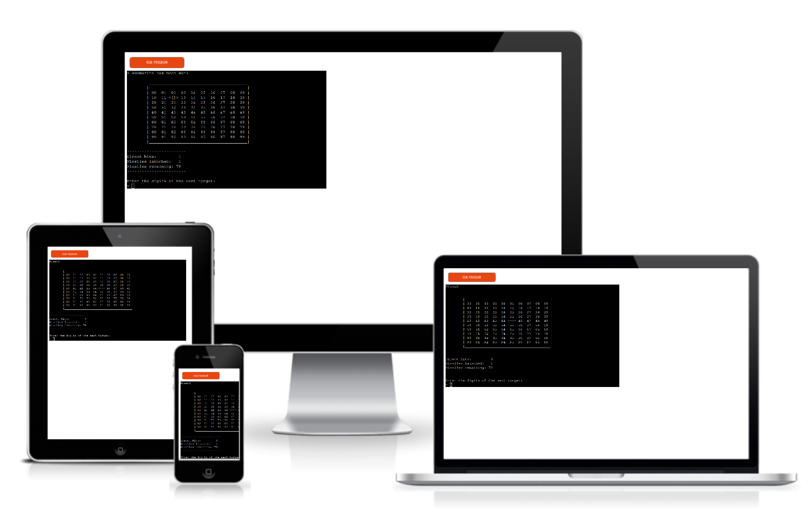
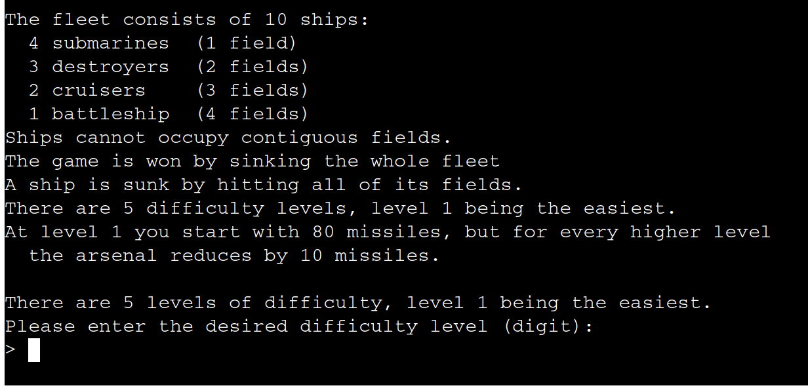
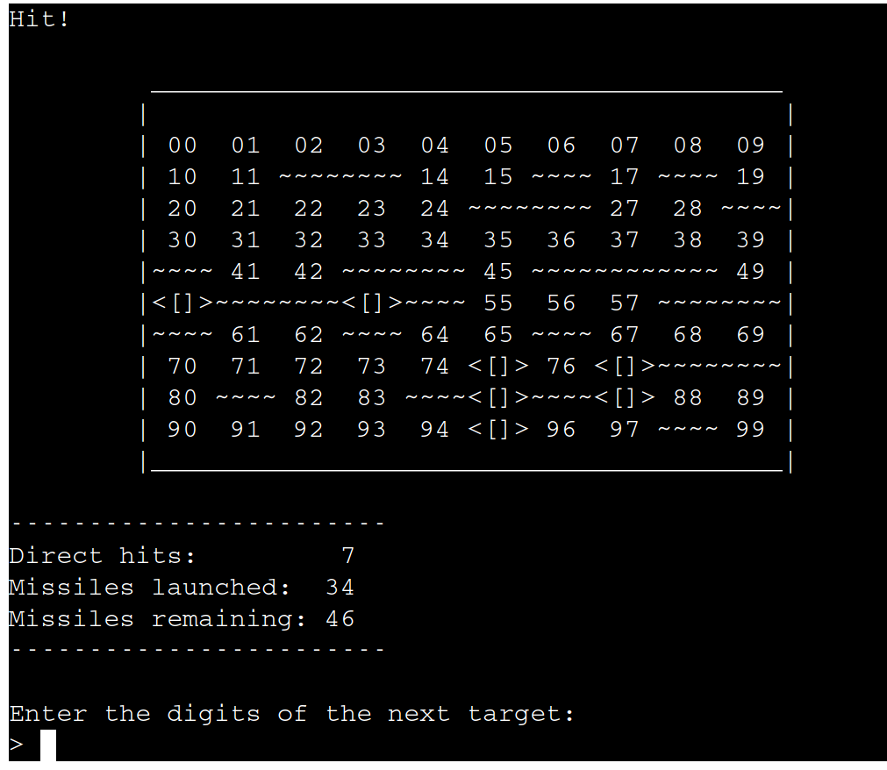
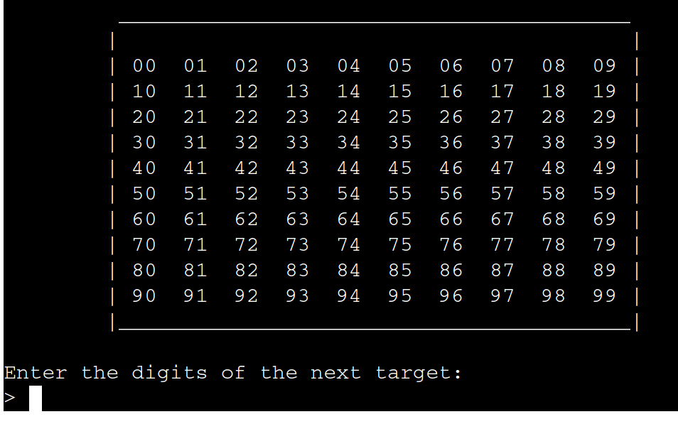
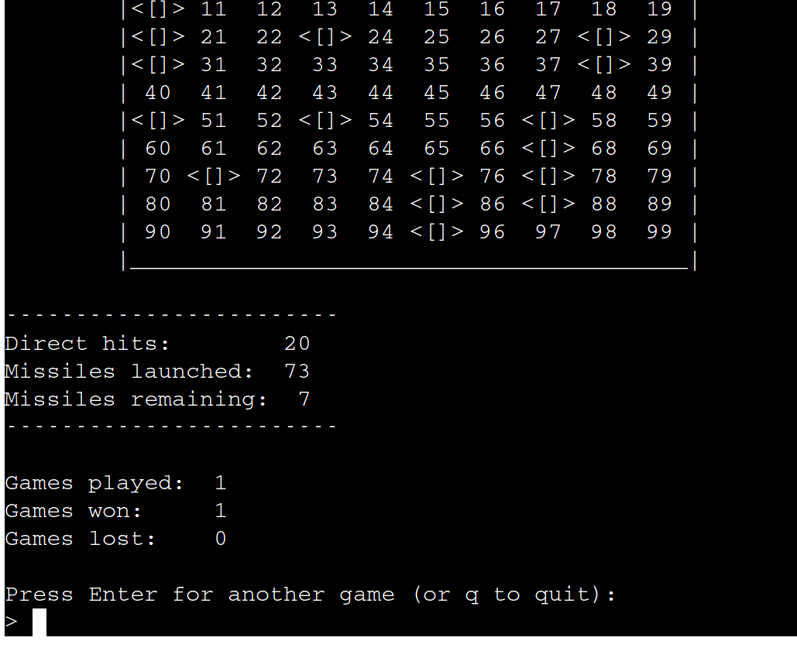
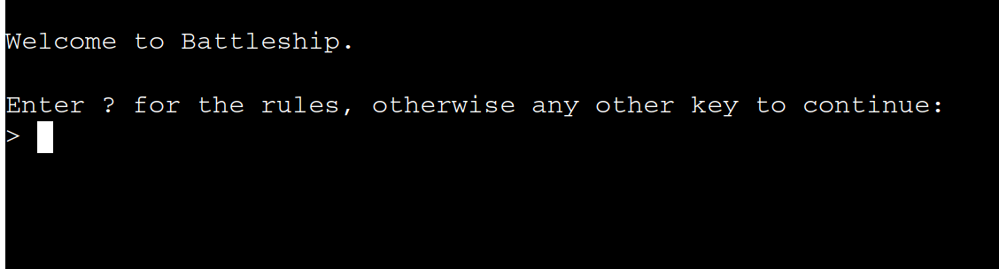
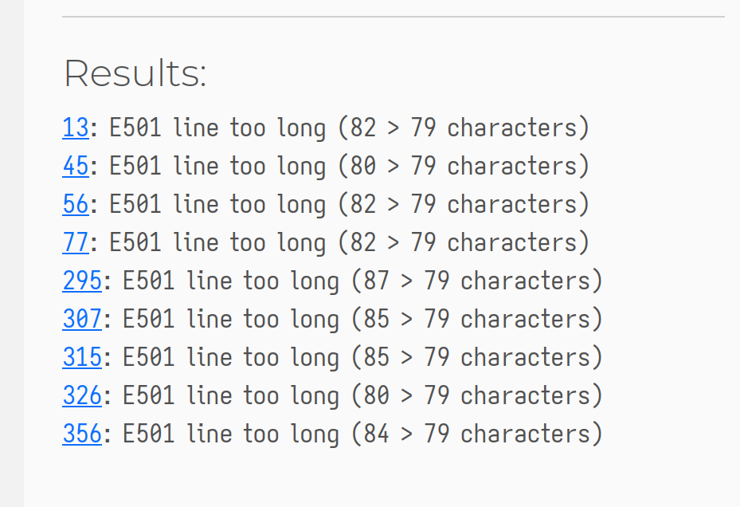

# Battleships

Battleships is a terminal game written in Python. This version invokes a mix of features from the many variants of the classic game that have appeared down the years.

## How to play

The user doesn't play the computer as such, but rather against themselves. Since the fleet's positions are set at the start of the game and the subsequent time is spent simply trying to hit all the ships before the stock of missiles runs out.

## Features

### Existing Features

- Random board generation
  - the player cannot see where the ships of the fleet are located.

- Scores across multiple games are maintained, and only lost when the application is exited.

- Input-validation and error-checking
  - coordinates cannot be chosen if they lay outside the board
  - only two-digit numbers are permissible as input for each turn.
  - entering the same input for more than one turn is noted but not forgiven! A missile is wasted by this so the user has to concentrate.
- Five difficulty levels
  

### Future Features

- Allow a ship to move every 5 turns, thus bringing previously hit fields back into consideration.
- Relax the rule about a ship's fields being forbidden from occupying contiguous fields.

## Data Model

I use two classes, one for the board, `PlayingBoard` the other for each ship, `Ship`.
The `PlayingBoard` class stores the ‘fields’ which are represented by a tuple of coordinates, in a way akin to coordinate geometry
Methods for the `PlayingBoard` class are available to initiate populating the board with ships (although the work is shared between this and methods belonging to the `Ship` class), and printing to the screen the current state of the board, as well as an alternative version of this general printing method that prints the whole fleet's positions.

The `Ship` class stores the size of each ship, that is how many fields it occupies. The size property is all an instance of the class requires to set both the type as well as the initial list of fields too (which will initially be a list of as many empty tuples as the size).
The class has only one method but it does a lot of work. A field is chosen at random from the list of vacant fields and then depending on the size of the ship object, an attempt is made to plot a set of coordinates for the ship. If the coordinates aren't permissible because they touch the fields of other ships then another attempt is made and so on until a permissible set of coordinates is found.

## Testing

I have manually tested this project by doing the following:

- I passed the code through the PEP8 linter. No errors, but some warnings about the code width exceeding 80 characters as mentioned below.
- Giving invalid inputs, such as non-digits when digits are expected, too many/few arguments, input that has already been submitted.
- Tested on various terminals on my local machine: Kitty, XTerm, the various terminal emulators that Emacs can use too. None presented problems. GitPod's terminal also worked without issue.
- The Heroku terminal was also fine, with the exception I refer to below, which was due to limitations on Heroku's terminal app's height. I resolved the issue and the Heroku terminal presented no other issue.

### Bugs

#### Solved Bugs

- During development I was sporadically getting errors with the method, `generate_ship_position()`, that calculates possible lists of coordinates for each ship. Sometimes it would generate the whole fleet's coordinates successfully, but other times it would because the final `return` value of the method was `None`. This happened whenever the first attempt to generate coordinates failed, because the subsequent iteration through the code failed. I don't entirely undstand why this was. Nevertheless, I resolved the issue by wrapping the call to `generate_ship_position()` in an try/exception block, which then worked perfectly.
- Heroku's dimensions of only 80x24 characters meant I had limit to decrease the height of the on-screen graphical representation of the board. A trivial problem that was easily solved by simply deleting the spacing between rows, but it counted as a bug because it limited the game's playability.

### Remaining Bugs

- None

### Validator Testing

- PEP8
  - No errors, merely a few warnings about lines exceeding 80 characters
    

## Deployment

Initially, I developed the site on my local machine and ran in the terminal while I played around with a few ideas.

Later I deployed the site using **Heroku**: [https://wymmij.github.io/ci-portfolio-project2/index.html](https://wymmij.github.io/ci-portfolio-project2/index.html)

- Steps for deployment:
  - Fork or clone this repository
  - Create a new Heroku app
  - Set the buildpacks to `Python` and `NodeJS`, noting that they must follow this order
  - Link the Heroku app to the repository
  - Click on Deploy

## Credits

- Code Institute for the deployment terminal.
- I also referred frequently to a number of Python related books, primarily:
  - [The official Python documentation](https://docs.python.org/3/index.html): particularly the tutorial and the language reference.
- I also worked through much of the chapter on Exceptions in ‘Python in a Nutshell’ (4th Edition) with many authors and published by O'Reilly.
- Another book that isn't solely about Python but that I found very useful was the first 3 chapters of ‘The Object-Oriented Thought Process’ (5th Edition) by Matt Weisfeld, published by Addison-Wesley
